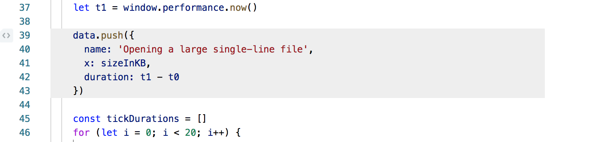
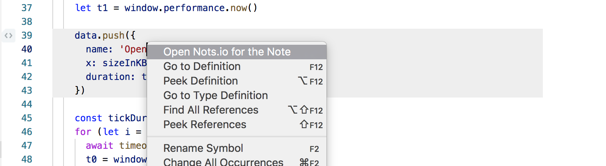
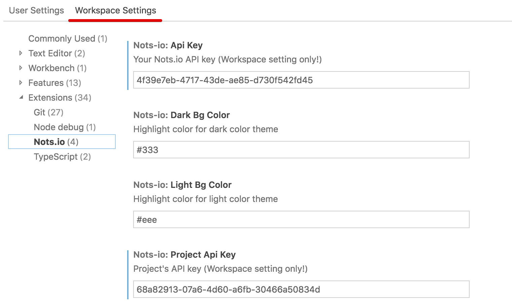
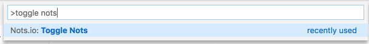

   
  

> The golden rule of documentation is to keep docs **close** to the code. [Nots.io](https://nots.io) lets you attach text, file or image directly to the source code. We track **changes** in it so your docs are always in-sync with the real source of truth — with your code.

## Nots.io VSCode plugin

VSCode plugin is an open-source extension for Visual Studio Code. It shows an gutter icon when there's a note added on this line in Nots.io.

The note area is higlighted with gray color. Click right button and select "Open Nots.io for the Note" to get full information about the note, discussions and attached files.

To make plugin work, it's required to set up User's API key and Project's API key. In order to work properly they should be set on "Worspace Settings" level only.

To temporary disable/enable icons and note area   highlighting, the command "Toggle Nots" is defined.

## Requirements

* vscode 1.31.0 and up
* macos, linux or windows

## Extension Settings

The `nots-io.lightBgColor` and `nots-io.darkBgColor` settings let you define a bite area higlighting color for light and dark theme respectively.

## Known Issues

[Open Bugs](https://github.com/notsio/vscode/issues)

## Release Notes

Users appreciate release notes as you update your extension.

### 0.1.8
Stable release with proper README