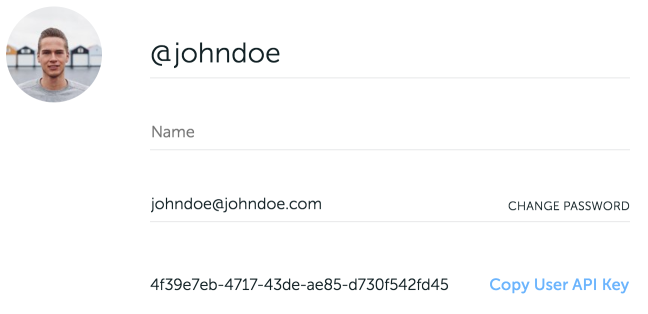
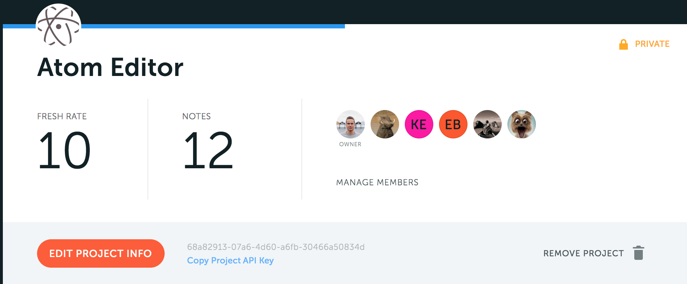

   
  

> The golden rule of documentation is to keep docs **close** to the code. [Nots.io](https://nots.io) lets you attach text, file or image directly to the source code. We track **changes** in it so your docs are always in-sync with the real source of truth — with your code.

## Nots.io VSCode plugin

VSCode plugin is an open-source extension for Visual Studio Code. It shows a gutter icon when there's a note added on this line in Nots.io.

The note area is higlighted with gray color. Click right button and select "Open Nots.io for the Note" to get full information about the note, discussions and attached files.

## Configuration

To make plugin work, it's required to set up User API key and Project API key. In order to work properly they should be set on "Worspace Settings" level only.

### User API Key

First, go to [Nots.io](https://nots.io/login) site, the [Profile section](https://app.nots.io/settings/profile). 
Find and click `Copy User API Key` button 
The User API Key is in your clipboard. Paste it into the `Nots-io: API Key` field on the VSCode settings page.

### Project API Key

Now, on Nots.io site go to the index page of the project you want to integrate with, and click `Copy Project API Key`. 

The Project API Key is in your clipboard.
Paste it into the `Nots-io: Project API Key` field on the VSCode settings page.

## Commands

To temporary disable/enable icons and note area highlighting, the command "Toggle Nots" is defined.

## Requirements

* vscode 1.31.0 and up
* macos, linux or windows

## Extension Settings

The `nots-io.lightBgColor` and `nots-io.darkBgColor` settings let you define a bite area higlighting color for light and dark theme respectively.

## Known Issues

[Open Bugs](https://github.com/notsio/vscode/issues)

## Release Notes

### 0.1.8
Stable release with proper README